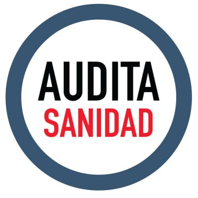

```{r echo=F}
require(knitr)
opts_chunk$set(comment=NA, results='asis', tidy=F, message=F, cache=F, echo=F)
options(RCHART_WIDTH=800, RCHART_HEIGHT=400, xtable.type='html')
```

<script src="http://ajax.googleapis.com/ajax/libs/jquery/1.9.1/jquery.min.js"></script>

## El papel del sector privado en el Presupuesto de la Consejería de Sanidad de Madrid 2015

</p>

<a href="http://auditasanidad.org/">http://auditasanidad.org/</a>


---

## Objetivos

> 1. **Cuantificar los contratos** adjudicados por la Consejería de Sanidad
a empresas privadas **y su importe** en cinco modalidades de contratación:
  - Suministros
  - Servicios
  - Gestión de Servicios Públicos
  - Obras
  - Administrativos especiales

> 2. Investigar las **conexiones entre empresas adjudicatarias y los lobbies** más
representativos en el sector sanitario

> 3. **Difundir eficazmente los resultados de esta investigación a la ciudadanía**

<!-- Incremental lists -->
<script>
$('ul.incremental li').addClass('fragment')
$('ol.incremental li').addClass('fragment')
</script>

--- 

## Metodlogía

Principal fuente de información:
**Boletín Oficial de la Comunidad de Madrid (BOCM)**.
(Del 1 de enero al 31 de diciembre de 2015)

Sólo se han tenido en cuenta para esta investigación los contratos adjudicados y formalizados dentro de ese marco cronológico.

No se han considerado:
- Concesiones administrativas (Hospitales modelo PFI y PPP)
- Conciertos realizados con hospitales y clínicas privadas para el tratamiento de pacientes
- Prescripción de recetas por parte de los profesionales sanitarios a pacientes (Recetas)
- Trabajos realizados por empresas de proceso de datos

--- &vertical


<!-- ## Evolución de la deuda de la Comunidad de Madrid -->
<!-- ```{r, results='asis'} -->
<!-- require(htmlwidgets) -->
<!-- require(dygraphs) -->
<!-- datos <- read.csv("datos/evolucion-deuda-madrid.csv") -->
<!-- deuda <- ts(datos$Deuda, start=c(2000, 1), end=c(2015, 1), frequency=1) -->
<!-- dygraph(deuda, main = "") -->
<!-- ``` -->

<!-- *** -->

<!-- ## Evolución de la deuda de la Comunidad de Madrid -->
<!-- ```{r deuda_comunidad_madrid2} -->
<!-- require(htmlwidgets) -->
<!-- require(plotly) -->
<!-- datos <- read.csv("datos/evolucion-deuda-madrid.csv") -->
<!-- x <- list(title = "Año") -->
<!-- y <- list(title = "Millones de €") -->
<!-- p <- plot_ly(x = datos$Anio, y = datos$Deuda, name = "Deuda", type = "bar") %>% -->
<!--   layout(xaxis = x, yaxis = y) -->
<!-- p -->
<!-- ``` -->

<!-- *** -->

## Evolución de la deuda de la Comunidad de Madrid
```{r deuda-comunidad-madrid}
require(rCharts)
data <- read.table("datos/evolucion-deuda-madrid.csv", header = TRUE, sep=",")
p1 <- nPlot(Deuda ~ Anio, data = data, type = "multiBarChart")
p1$xAxis(axisLabel = 'Año')
p1$yAxis(axisLabel = 'Gasto (Millones €)', width=100, tickFormat = "#! function(d) {return d/1000000 + 'M€' } !#")
p1$chart(margin = list(left = 100))
p1
```

<!-- *** -->

<!-- ## Evolución de la deuda de la Comunidad de Madrid -->
<!-- ```{r } -->
<!-- require(htmlTable) -->
<!-- colnames(data) <- c("Año", "Deuda") -->
<!-- tmp <- htmlTable(data, align="lr", rnames=FALSE, css.class="colortable",  -->
<!--   tfoot="<span class=\"footnote\">Fuente: Elaboración propia</span>") -->
<!-- (tmp <- gsub('<td', '<td nowrap="nowrap"; ', tmp)) -->
<!-- ``` -->

---

## Gasto en medios ajenos
#### Presupuestos Consejería Sanidad de Madrid 2015 (3.143.914.276 €)

```{r gasto-medios-ajenos}
require(rCharts)
data <- read.table("datos/gasto-medios-ajenos.csv", header = TRUE, sep=",")
p2 <- nPlot(Cantidad ~ Tipo.de.gasto, data = data, type = "pieChart")
p2$chart(margin = list(left = 100))
p2$setTemplate(afterScript = '<style> svg text {font-size: 18px;}</style>')
p2
```

---

## Actividades realizadas con medios ajenos
#### Presupuestos Consejería Sanidad de Madrid 2015

```{r actividades-medios-ajenos}
require(rCharts)
data <- read.table("datos/actividades-medios-ajenos.csv", header = TRUE, sep=",")
p3 <- nPlot(Cantidad ~ Actividad, data = data, type = "multiBarHorizontalChart")
p3$yAxis(axisLabel = 'Cantidad (€)')
p3$chart(margin = list(left = 350))
p3
```

---

## Contratación pública en 2015
### 1.295 contratos por valor de 490.932.459 €

```{r contratacion-publica-modalidad}
require(rCharts)
data <- read.table("datos/importe-contratos-modalidad.csv", header = TRUE, sep=",")
data$Porcentaje = round((data$Cantidad/sum(data$Cantidad)) * 100,2)
p4 <- nPlot(Cantidad ~ Modalidad.contrato, data = data, type = "pieChart")
p4$chart(tooltipContent = "#! function(key, y, e, graph){return '<h3>' + 'Modalidad: ' + key + '</h3>' + '<p>'+ 'Cantidad: ' + y + '<br>' + e.point.Porcentaje + ' %'} !#")
p4$setTemplate(afterScript = '<style> svg text {font-size: 18px;}</style>')
#p4$chart(donut=TRUE)
#p4$chart(margin = list(left = 350))
p4
```

--- &vertical

## Ranking de empresas adjudicatarias 

```{r ranking-empresas-adjudicatarias}
require(rCharts)
data <- read.table("datos/ranking-empresas.csv", header = TRUE, sep=",")
p <- nPlot(Cantidad ~ Empresa, group="Tipo", data = data, type = "multiBarHorizontalChart")
p$yAxis(axisLabel = 'Cantidad (€)')
p$chart(margin = list(left = 350))
#p$chart(showControls = F)
p
```

***

## Ranking de empresas adjudicatarias 
## Top 10

```{r ranking-empresas-adjudicatarias-top-10}
require(rCharts)
data <- read.table("datos/ranking-empresas.csv", header = TRUE, sep=",")
p <- nPlot(Cantidad ~ Empresa, data = head(data,10), type = "multiBarHorizontalChart")
p$yAxis(axisLabel = 'Cantidad (€)')
p$chart(margin = list(left = 350))
#p$chart(showControls = F)
p
```

---

## La Industria Farmaceútica
#### Contratos por un valor de 235.875.604€ (48,05%)

- Roche SA
- Novartis
- Pfizer SLU
- Gilead Sciences SL
- Janssen Cilag SA–Johnson & Johnson SA
- Sanofi
- GlaxoSmithKline

---

## Empresas de Tecnología Médica
#### Contratos por valor de 23.891.312€ (4,87%)

- Siemens
- Medtronic Ibérica SA – Covidien Spain SA
- General Electric Healthcare
- Philips Ibérica SA
- Boston Scientific Ibérica SA

--- &vertical

## Los Lobbies
#### Contratos por valor de 299.472.851€ (61%)

- Farmaindustria
- Fundación IDIS (Instituto para el Desarrollo e Integración de la Sanidad)
- SEDISA
- Federación Española de Empresas de Tecnología Sanitaria (FENIN)
- Club Gertech, ASEBIO, Fundación ECO, FUINSA y el
- Foro PPP

**¡Claro indicador del fortalecimiento del sector privado!**

***

## Ranking lobbies adjudicatarios 

```{r ranking-lobbies}
require(rCharts)
data <- read.table("datos/ranking-lobbies.csv", header = TRUE, sep=",")
p <- nPlot(Cantidad ~ Lobby, data = data[order(-data$Cantidad),], type = "multiBarHorizontalChart")
p$yAxis(axisLabel = 'Cantidad (€)')
p$chart(margin = list(left = 350))
#p$chart(showControls = F)
p
```

--- 

## Propuestas de Audita Sanidad

Las partidas presupuestarias o contratos que beneficien a ciertos sectores económicos antes que al interés general de la ciudadanía deben denunciarse como configuradores de **deuda ilegítima**.

- Hospital de Collado Villalba. La Consejería de Sanidad ha abonado a Quirónsalud (antes IDC Salud, previamente Capio) 900.000,- euros mensuales durante dos años permaneciendo durante este tiempo cerrado.
- Hospitales modelo PFI y modelo PPP.
- Consumo farmacéutico.

Es urgente y necesario que se inicie un proceso sistemático de **Auditoría Ciudadana de la Deuda en Sanidad** para pormenorizarla, hacerla visible y, en su caso, no pagarla, transfiriendo la responsabilidad a los políticos implicados.

---

## ¡Gracias por su atención!


